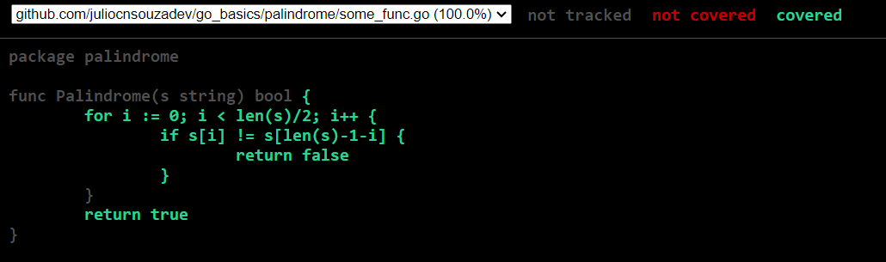

# Go Basics Labs

## Tests with coverage

```bash
go test ./... -cover
```
Where there are tests the output will look like
```
ok      github.com/juliocnsouzadev/go_basics/palindrome 0.959s  coverage: 100.0% of statements
```
<hr>

```bash
go test ./... -coverprofile=coverage.out
```
Running the above will create a file with more info about the coverage. Can be opened as follows:

```bash
go tool cover -func=coverage
```
The output will look like:
```
github.com/juliocnsouzadev/go_basics/palindrome/some_func.go:3: Palindrome      100.0%
total:                                                          (statements)    100.0%
```
Or can be opened in html format:

```bash
go tool cover -html=coverage       
```
Where you can see exactly wich parts of the code are covered and wich are not.


